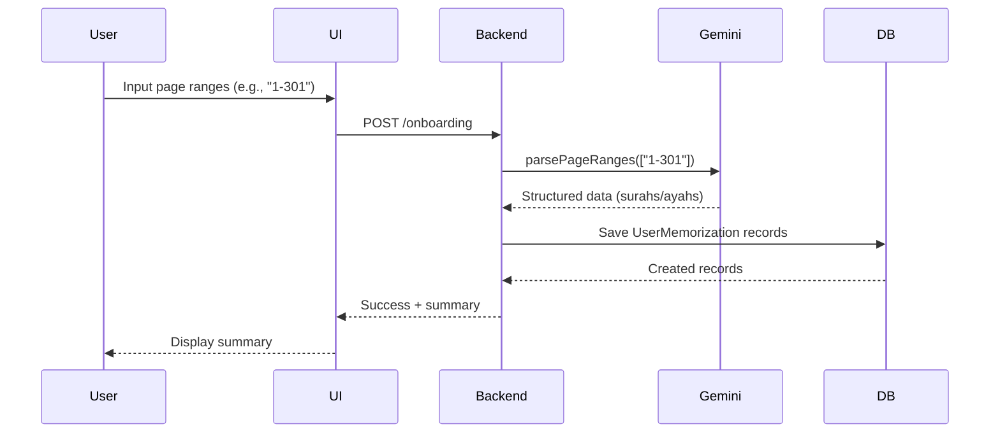
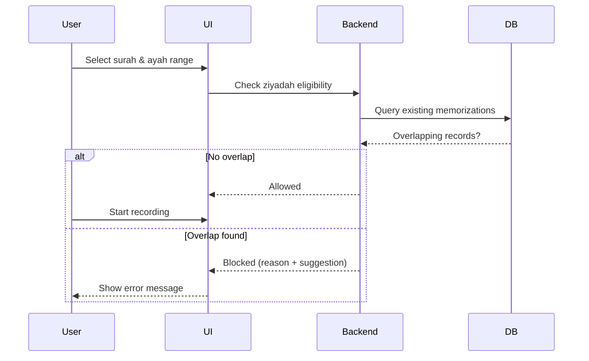
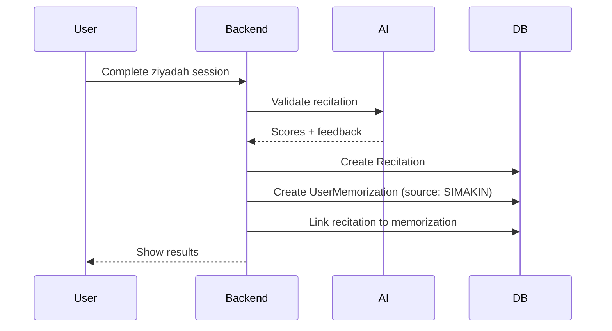

# Memorization Tracking System Documentation

## Overview

The Memorization Tracking System allows users to record their existing Qur'an memorizations during onboarding and tracks new memorizations (ziyadah) completed through the app. This system prevents duplicate memorizations and enables comprehensive reporting of learning progress.

## Key Features

✅ **Onboarding Memorization Input**: Users can input their existing memorizations by page ranges
✅ **AI-Powered Parsing**: Gemini AI converts page ranges to structured surah/ayah data
✅ **Duplicate Prevention**: System blocks ziyadah attempts for already-memorized ranges
✅ **Source Tracking**: Distinguishes between memorizations from onboarding vs. app sessions
✅ **Flexible Murojaah**: Users can review any range, regardless of memorization status
✅ **Comprehensive Reports**: Track ziyadah and murojaah history by time periods

## Architecture

### 1. Database Schema

```prisma
enum MemorizationStatus {
  PLANNED      // User plans to memorize this
  IN_PROGRESS  // Currently working on it
  COMPLETED    // Finished memorizing
}

enum MemorizationSource {
  SIMAKIN      // Memorized through the app (via recitation)
  ONBOARDING   // Existing memorization from onboarding
  MANUAL       // Added manually by user
}

model UserMemorization {
  id        String              @id @default(cuid())
  userId    String

  // Surah and ayah range
  surah     Int                 // Surah number (1-114)
  startAyah Int                 // Starting ayah number
  endAyah   Int                 // Ending ayah number

  // Status tracking
  status    MemorizationStatus  @default(COMPLETED)
  source    MemorizationSource  @default(SIMAKIN)

  // Metadata
  completedAt DateTime?
  createdAt   DateTime
  updatedAt   DateTime

  // Relations
  user        User         @relation(...)
  recitations Recitation[] // Ziyadah sessions linked to this

  @@unique([userId, surah, startAyah, endAyah]) // No duplicates
}

model Recitation {
  // ...existing fields

  memorizationId String?
  memorization   UserMemorization? @relation(...)
}
```

### 2. Core Components

#### A. Gemini AI Model (`app/lib/gemini/gemini.ts`)

**Purpose**: Parse page ranges into structured memorization data

**Input**: Page ranges (e.g., "1-301, 500-604")

**Output**: JSON with surah/ayah breakdowns

**System Instruction**:

```typescript
modelParsePageRanges({
  systemInstruction: `
    Convert Qur'an page ranges (Mushaf Rasm Utsmani) to:
    - Surah number
    - Start ayah
    - End ayah
    - Completion status
  `,
});
```

**Example Response**:

```json
{
  "memorizations": [
    {
      "surah": 1,
      "surah_name": "Al-Fatihah",
      "start_ayah": 1,
      "end_ayah": 7,
      "total_ayah": 7,
      "is_complete": true
    },
    {
      "surah": 2,
      "surah_name": "Al-Baqarah",
      "start_ayah": 1,
      "end_ayah": 74,
      "total_ayah": 286,
      "is_complete": false
    }
  ],
  "summary": {
    "total_surahs": 2,
    "total_ayahs": 81,
    "complete_surahs": 1,
    "partial_surahs": 1,
    "page_range": "1-10"
  }
}
```

#### B. Memorization Service (`app/services/memorization/memorization.server.ts`)

**Functions**:

1. **parsePageRanges(pageRanges: string[])**
   - Calls Gemini AI to parse page ranges
   - Returns structured memorization data
2. **saveOnboardingMemorization(userId: string, pageRanges: string[])**
   - Parses page ranges with Gemini
   - Saves all records to database
   - Source: ONBOARDING
   - Status: COMPLETED
3. **canUserDoZiyadah({userId, surah, startAyah, endAyah})**
   - Checks for overlapping memorizations
   - Returns eligibility status with reason
4. **getUserMemorizations(userId: string, filters?)**
   - Query memorization history
   - Filter by source or status
5. **getMemorizationStats(userId: string)**
   - Calculate statistics (total surahs, ayahs, etc.)
6. **deleteMemorization(userId: string, memorizationId: string)**
   - Delete ONBOARDING or MANUAL records only
   - SIMAKIN records are immutable

## User Flows

### Flow 1: Onboarding - Input Existing Memorization



### Flow 2: Ziyadah Session - Validation



### Flow 3: After Ziyadah Completion



## Business Rules

### 1. Overlap Detection

**Definition**: Two ranges overlap if they share any ayahs.

**Examples**:

```typescript
// Exact match
User has: Al-Fatihah 1-7
Ziyadah attempt: Al-Fatihah 1-7
Result: ❌ BLOCKED

// Subset
User has: Al-Baqarah 1-50
Ziyadah attempt: Al-Baqarah 10-20
Result: ❌ BLOCKED (subset is overlap)

// Overlap
User has: Al-Baqarah 1-50
Ziyadah attempt: Al-Baqarah 40-80
Result: ❌ BLOCKED (ayah 40-50 overlap)

// No overlap
User has: Al-Baqarah 1-50
Ziyadah attempt: Al-Baqarah 51-100
Result: ✅ ALLOWED
```

**Implementation**:

```typescript
// Check overlap with SQL
AND: [
  { startAyah: { lte: endAyah } }, // Existing start <= New end
  { endAyah: { gte: startAyah } }, // Existing end >= New start
];
```

### 2. Source Immutability

| Source     | Can Edit? | Can Delete? | Created By                   |
| ---------- | --------- | ----------- | ---------------------------- |
| ONBOARDING | ✅ Yes    | ✅ Yes      | User input during onboarding |
| MANUAL     | ✅ Yes    | ✅ Yes      | User adds manually later     |
| SIMAKIN    | ❌ No     | ❌ No       | Completed ziyadah session    |

**Rationale**: SIMAKIN records are tied to actual recitation sessions and should be permanent for accurate history.

### 3. Murojaah Flexibility

- ✅ Users can murojaah ANY range (even if not memorized)
- ⚠️ Warning shown if range not in memorization records
- 📊 Murojaah sessions tracked separately in Recitation table

### 4. Page Range Standard

- **Standard**: Mushaf Rasm Utsmani
- **Total Pages**: 604
- **Page 1**: Al-Fatihah 1
- **Page 604**: An-Nas (end)

## API Integration

### Endpoint 1: Save Onboarding Memorization

```typescript
POST /api/onboarding/memorization

Body:
{
  "pageRanges": ["1-301", "500-604"]
}

Response:
{
  "success": true,
  "records": [
    {
      "id": "...",
      "surah": 1,
      "startAyah": 1,
      "endAyah": 7,
      "source": "ONBOARDING"
    },
    // ... more records
  ],
  "summary": {
    "total_surahs": 50,
    "total_ayahs": 2500,
    "complete_surahs": 30,
    "partial_surahs": 20
  }
}
```

### Endpoint 2: Validate Ziyadah

```typescript
GET /api/memorization/validate-ziyadah?surah=1&start=1&end=7

Response (Allowed):
{
  "allowed": true
}

Response (Blocked):
{
  "allowed": false,
  "reason": "Anda sudah memiliki hafalan untuk range ayat ini",
  "suggestion": "Silakan pilih range ayat yang berbeda",
  "existingRecord": {
    "surah": 1,
    "startAyah": 1,
    "endAyah": 7,
    "source": "ONBOARDING"
  }
}
```

### Endpoint 3: Get Memorization Stats

```typescript
GET /api/memorization/stats

Response:
{
  "totalSurahs": 15,
  "totalAyahs": 1200,
  "totalRecords": 30,
  "fromOnboarding": 20,
  "fromSimakin": 10,
  "completedMemorizations": 30
}
```

## Error Handling

### Gemini AI Errors

```typescript
try {
  const data = await parsePageRanges(["1-301"]);
} catch (error) {
  // Possible errors:
  // - API timeout
  // - Invalid JSON response
  // - Quota exceeded
  // - Network error

  throw new Error("Failed to parse page ranges. Please try again.");
}
```

### Database Errors

```typescript
// Unique constraint violation
// User tries to save duplicate range
Error: P2002
Solution: Check existing records before saving

// Foreign key constraint
// User deleted, cascade to UserMemorization
Handled by: onDelete: Cascade
```

## Performance Considerations

### 1. Bulk Insert Optimization

```typescript
// Instead of sequential inserts:
❌ for (record of records) {
     await db.userMemorization.create(...)
   }

// Use parallel inserts:
✅ await Promise.all(
     records.map(r => db.userMemorization.create(...))
   )
```

### 2. Overlap Query Optimization

```typescript
// Indexed columns for fast overlap detection:
@@index([userId, surah])
@@index([userId, status])

// Query uses these indexes
```

### 3. Gemini AI Caching

```typescript
// Future optimization: Cache common page ranges
// Example: "1-604" (full Qur'an) → cached result
```

## Testing

### Test Scenarios

1. **Parse Single Page Range**

   ```typescript
   Input: ["1-10"]
   Expected: Al-Fatihah + partial Al-Baqarah
   ```

2. **Parse Multiple Ranges**

   ```typescript
   Input: ["1-301", "500-604"]
   Expected: Juz 1-15 + Juz 27-30
   ```

3. **Overlap Detection - Exact Match**

   ```typescript
   Existing: Al-Fatihah 1-7
   New: Al-Fatihah 1-7
   Expected: BLOCKED
   ```

4. **Overlap Detection - Subset**

   ```typescript
   Existing: Al-Baqarah 1-100
   New: Al-Baqarah 50-60
   Expected: BLOCKED
   ```

5. **Overlap Detection - No Overlap**

   ```typescript
   Existing: Al-Baqarah 1-50
   New: Al-Baqarah 51-100
   Expected: ALLOWED
   ```

6. **Delete SIMAKIN Record**
   ```typescript
   Record source: SIMAKIN
   Expected: Error - immutable
   ```

## Future Enhancements

### Phase 1 (Current)

- ✅ Basic onboarding input
- ✅ Gemini AI parsing
- ✅ Overlap detection
- ✅ Basic statistics

### Phase 2 (Planned)

- [ ] Visual progress tracker (heatmap)
- [ ] Edit existing memorizations
- [ ] Bulk input by Juz
- [ ] Export memorization list (PDF/CSV)

### Phase 3 (Future)

- [ ] Spaced repetition system
- [ ] Auto-suggest murojaah schedules
- [ ] Memorization goals & milestones
- [ ] Social features (share progress)

## Related Documentation

- **EXP System**: `docs/EXP_SYSTEM.md`
- **Streak System**: `docs/STREAK_IMPLEMENTATION.md`
- **Gemini AI**: `app/lib/gemini/gemini.ts`

## Changelog

### October 28, 2025

- Initial implementation
- Database schema created
- Gemini AI integration
- Core service functions
- Overlap detection logic
