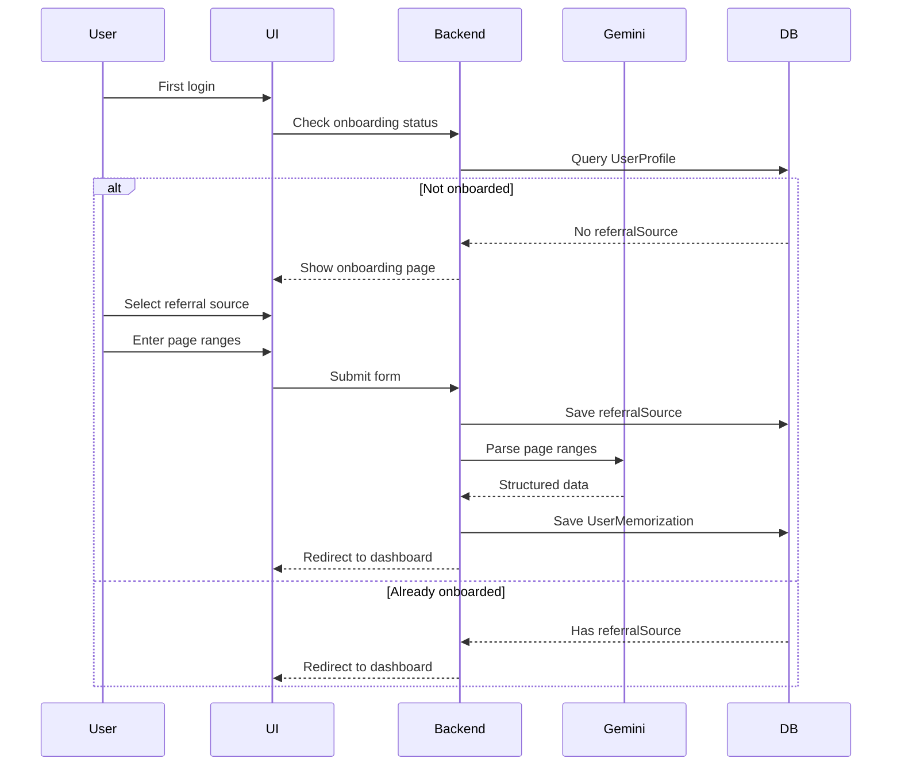

# Onboarding System Documentation

## Overview

The Onboarding System collects essential information from new users during their first login, including:

1. **Referral Source**: How they discovered the app
2. **Existing Memorization**: What Qur'an pages they've already memorized

This data helps with analytics and personalizes the user experience.

## Features

✅ **Referral Source Tracking**: Track acquisition channels (Instagram, TikTok, friends, etc.)
✅ **Flexible Input**: Support for "Other" with custom text input
✅ **Memorization Import**: AI-powered conversion of page ranges to structured data
✅ **Skip Option**: Users can complete onboarding later
✅ **One-Time Only**: Automatic redirect if already completed

## Database Schema

### User Profile Extension

```prisma
enum ReferralSource {
  INSTAGRAM
  TIKTOK
  YOUTUBE
  FACEBOOK
  TWITTER
  WEBSITE
  GOOGLE_SEARCH
  FRIEND
  FAMILY
  TEACHER
  MOSQUE
  SCHOOL
  OTHER
}

model UserProfile {
  // ...existing fields

  // Onboarding data
  referralSource ReferralSource? // How user found the app
  referralOther  String?         // Custom text if source is OTHER
}
```

## User Flow



## Referral Sources

| Value         | Display Label     | Category      |
| ------------- | ----------------- | ------------- |
| INSTAGRAM     | Instagram         | Social Media  |
| TIKTOK        | TikTok            | Social Media  |
| YOUTUBE       | YouTube           | Social Media  |
| FACEBOOK      | Facebook          | Social Media  |
| TWITTER       | Twitter (X)       | Social Media  |
| WEBSITE       | Website/Blog      | Online        |
| GOOGLE_SEARCH | Google Search     | Search Engine |
| FRIEND        | Teman             | Word of Mouth |
| FAMILY        | Keluarga          | Word of Mouth |
| TEACHER       | Guru/Ustadz       | Education     |
| MOSQUE        | Masjid/Musholla   | Community     |
| SCHOOL        | Sekolah/Pesantren | Education     |
| OTHER         | Lainnya           | Other         |

### Adding New Sources

To add a new referral source:

1. **Update enum in schema**:

```prisma
enum ReferralSource {
  // ...existing
  NEW_SOURCE
}
```

2. **Update UI component**:

```typescript
const REFERRAL_SOURCES = [
  // ...existing
  { value: "NEW_SOURCE", label: "New Source", icon: SomeIcon },
];
```

3. **Run migration**:

```bash
npx prisma migrate dev --name add_new_referral_source
```

## Implementation

### Route: `/app/onboarding`

**File**: `app/routes/app/onboarding/index.tsx`

**Layout**: Fullscreen (no sidebar)

**Access**: Protected (requires authentication)

### Loader Function

```typescript
export async function loader({ request }: Route.LoaderArgs) {
  const userId = await requireUserId(request);

  // Check if user already completed onboarding
  const profile = await db.userProfile.findUnique({
    where: { userId },
    select: { referralSource: true },
  });

  // Redirect if already onboarded
  if (profile?.referralSource) {
    return redirect("/app/dashboard");
  }

  return { userId };
}
```

**Purpose**: Prevent re-onboarding

### Action Function

```typescript
export async function action({ request }: Route.ActionArgs) {
  const userId = await requireUserId(request);
  const formData = await request.formData();

  const referralSource = formData.get("referralSource");
  const referralOther = formData.get("referralOther");
  const pageRanges = parsePageRanges(formData.get("pageRanges"));

  // Validate inputs
  if (!referralSource) {
    return { success: false, error: "Pilih sumber referral" };
  }

  if (pageRanges.length === 0) {
    return { success: false, error: "Masukkan range halaman" };
  }

  // Save referral source
  await db.userProfile.upsert({
    where: { userId },
    create: { userId, referralSource, referralOther },
    update: { referralSource, referralOther },
  });

  // Save memorization using Gemini AI
  await saveOnboardingMemorization(userId, pageRanges);

  return redirect("/app/dashboard");
}
```

## UI Components

### 1. Referral Source Select

```tsx
<Select name="referralSource" required>
  <SelectTrigger>
    <SelectValue placeholder="Pilih sumber..." />
  </SelectTrigger>
  <SelectContent>
    {REFERRAL_SOURCES.map((source) => (
      <SelectItem value={source.value}>
        <div className="flex items-center gap-2">
          <source.icon className="w-4 h-4" />
          {source.label}
        </div>
      </SelectItem>
    ))}
  </SelectContent>
</Select>
```

**Features**:

- Icon for each source
- Searchable dropdown
- Required field

### 2. "Other" Text Input (Conditional)

```tsx
{
  selectedSource === "OTHER" && (
    <Input name="referralOther" placeholder="Sebutkan sumbernya" required />
  );
}
```

**Behavior**:

- Only shows when "Lainnya" is selected
- Required when visible
- Examples shown: "WhatsApp Group, Telegram, dll"

### 3. Page Ranges Input

```tsx
<Textarea
  name="pageRanges"
  placeholder="Contoh: 1-301, 500-604"
  rows={3}
  required
/>
```

**Input Format**:

- Comma-separated: `1-301, 500-604`
- Newline-separated: `1-301\n500-604`
- Single range: `1-301`

**Validation**:

- Must have at least 1 range
- Spaces are trimmed
- Empty lines ignored

### 4. Action Buttons

```tsx
<Button variant="outline" onClick={() => navigate('/app/dashboard')}>
  Lewati (Nanti Saja)
</Button>

<Button type="submit" disabled={isSubmitting}>
  {isSubmitting ? 'Memproses...' : 'Selesai & Mulai'}
</Button>
```

**Behavior**:

- Skip: Go to dashboard without saving
- Submit: Process with Gemini AI + save

## Integration with Memorization System

### Flow After Submission

1. **Validate referral source** → Save to `UserProfile`
2. **Parse page ranges** → Call Gemini AI
3. **Save memorization** → Create `UserMemorization` records
4. **Redirect** → Dashboard with populated data

### Example Data Flow

**Input**:

```
Referral: INSTAGRAM
Page Ranges: 1-301, 500-604
```

**Gemini AI Processing**:

```json
{
  "memorizations": [
    { "surah": 1, "start_ayah": 1, "end_ayah": 7, ... },
    { "surah": 2, "start_ayah": 1, "end_ayah": 141, ... },
    // ... many more
  ]
}
```

**Database Records**:

```sql
-- UserProfile
UPDATE UserProfile SET referralSource = 'INSTAGRAM' WHERE userId = '...';

-- UserMemorization (multiple records)
INSERT INTO UserMemorization (userId, surah, startAyah, endAyah, source, status)
VALUES
  ('...', 1, 1, 7, 'ONBOARDING', 'COMPLETED'),
  ('...', 2, 1, 141, 'ONBOARDING', 'COMPLETED'),
  ...;
```

## Analytics Queries

### Referral Source Distribution

```typescript
const referralStats = await db.userProfile.groupBy({
  by: ["referralSource"],
  _count: true,
  orderBy: {
    _count: {
      referralSource: "desc",
    },
  },
});

// Result:
// [
//   { referralSource: 'INSTAGRAM', _count: 150 },
//   { referralSource: 'FRIEND', _count: 120 },
//   { referralSource: 'GOOGLE_SEARCH', _count: 80 },
//   ...
// ]
```

### Top "Other" Sources

```typescript
const otherSources = await db.userProfile.findMany({
  where: {
    referralSource: "OTHER",
    referralOther: { not: null },
  },
  select: {
    referralOther: true,
  },
});

// Manual grouping for custom text
const grouped = otherSources.reduce((acc, { referralOther }) => {
  acc[referralOther] = (acc[referralOther] || 0) + 1;
  return acc;
}, {});
```

### Onboarding Completion Rate

```typescript
const totalUsers = await db.user.count();
const onboardedUsers = await db.userProfile.count({
  where: {
    referralSource: { not: null },
  },
});

const completionRate = (onboardedUsers / totalUsers) * 100;
// Example: 85% of users completed onboarding
```

## Error Handling

### Gemini AI Timeout

```typescript
try {
  await saveOnboardingMemorization(userId, pageRanges);
} catch (error) {
  if (error.message.includes("timeout")) {
    return {
      success: false,
      error:
        "AI memproses terlalu lama. Silakan coba lagi dengan range lebih kecil.",
    };
  }
  throw error;
}
```

### Invalid Page Range

```typescript
if (pageRanges.some((r) => !r.match(/^\d+-\d+$/))) {
  return {
    success: false,
    error: "Format tidak valid. Gunakan format: 1-301",
  };
}
```

### Database Constraint Violation

```typescript
try {
  await db.userProfile.update({ ... });
} catch (error) {
  if (error.code === 'P2002') {
    // Unique constraint failed
    return { success: false, error: 'Data sudah ada' };
  }
  throw error;
}
```

## User Experience

### Loading States

1. **Initial Load**: Check onboarding status
2. **Form Submission**: Show "Memproses..." with spinner
3. **AI Processing**: Info alert about processing time
4. **Success**: Auto-redirect to dashboard

### Skip Behavior

- Users can skip onboarding
- Can complete later via settings (future feature)
- Data saved on first submission only

### Mobile Responsiveness

- Fullscreen on all devices
- Responsive card width (max-w-2xl)
- Touch-friendly select dropdowns
- Proper spacing for mobile keyboards

## Future Enhancements

### Phase 1 (Current)

- ✅ Basic referral source tracking
- ✅ Page range input
- ✅ Gemini AI integration
- ✅ One-time onboarding

### Phase 2 (Planned)

- [ ] Re-onboarding option in settings
- [ ] Analytics dashboard for admin
- [ ] A/B testing different onboarding flows
- [ ] Progress indicator (step 1 of 2)

### Phase 3 (Future)

- [ ] Visual page selector (interactive Qur'an)
- [ ] Referral program (invite friends)
- [ ] Onboarding video tutorial
- [ ] Gamification (complete onboarding = bonus EXP)

## Testing Checklist

### Manual Tests

- [ ] First-time user sees onboarding
- [ ] Already-onboarded user redirects to dashboard
- [ ] All referral sources selectable
- [ ] "Other" shows text input when selected
- [ ] Page range parsing works correctly
- [ ] Skip button works without saving
- [ ] Submit button triggers AI processing
- [ ] Success redirects to dashboard
- [ ] Error messages display properly

### Edge Cases

- [ ] Empty page ranges
- [ ] Invalid format (e.g., "abc-def")
- [ ] Very large ranges (1-604)
- [ ] Duplicate submissions
- [ ] Network timeout during AI processing

## Related Documentation

- **Memorization Tracking**: `docs/MEMORIZATION_TRACKING.md`
- **Gemini AI Integration**: `app/lib/gemini/gemini.ts`
- **Memorization Service**: `app/services/memorization/memorization.server.ts`

## Changelog

### October 28, 2025

- Initial onboarding system implementation
- Added `ReferralSource` enum with 13 options
- Created fullscreen onboarding UI
- Integrated with memorization tracking system
- Added skip functionality
- Implemented one-time redirect logic
